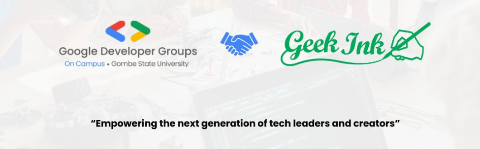

import Heading from '@site/src/components/Heading';
import Quotes from '@site/src/components/Quotes';
import Comment from '@site/src/components/comment';
import Tabs from '@theme/Tabs';
import TabItem from '@theme/TabItem';

<Quotes fetchFromAPI={true} />

> **Learn by Doing, Build with Purpose—Beyond Code, We Solve. Empowering Lives Through Technology.**  

At **Geek Ink**, we believe technology is more than just writing code—it's about **solving real-world problems** and creating impact. We foster a hands-on, collaborative learning experience that empowers individuals to become problem solvers and innovators.  

## **🌟 Why Geek Ink?**  
- ✅ **Learn by Doing** – Gain hands-on experience through real-world projects.  
- ✅ **Project-Based Learning** – Build **solutions**, not just write code.  
- ✅ **Solve Problems with Code** – Use technology to **empower** and **create impact**.  
- ✅ **Make Life Easier** – Innovate to drive meaningful change.  

---  

<Heading color="#1e88e5"> 🤝 **Our Partnership with GDG on Campus**</Heading>  

Geek Ink is proud to **partner with GDG on Campus** to provide students with:  

🔹 **Expert-Led Web Mentorship**  
🔹 **Workshops on MLOps & DevOps**  
🔹 **Real-World Open Source & Industry-Ready Projects**  
🔹 **Community Support & Networking Opportunities**  

Together, we are **shaping the next generation of developers** to **build, innovate, and lead in the tech industry**.  

---  

# 🌍 Mastering Web Development 

<Heading color="#ff9800">🚀 **First Cohort Starts: March 10, 2025** </Heading>   

## **What It Is**  
A **comprehensive 2-week introduction** to **modern web development**, designed to equip participants with **essential skills** before transitioning into **specialized frontend (React.js) or backend (Node.js, Express, MongoDB) tracks**.  

This is a **peer-learning study group**, where participants:  
✅ Learn the **core principles of web development**  
✅ Work on **hands-on coding exercises**  
✅ Collaborate in **weekly discussion sessions** led by mentors  
✅ Build **real-world projects**  

We use **MDN Web Docs, JavaScript.info, and FreeCodeCamp** as our primary study materials.  

---

<Heading level={4}>
📌 Who It’s For?  
</Heading>
Whether you're a **complete beginner**, a **designer wanting to code**, or a **developer looking to solidify your foundation**, this program will help you gain **confidence in web development**.  

---

## **📌 Prerequisites**  
✅ No prior coding experience required!  
✅ However, familiarity with:  
   - 🖥 Basic computer operations  
   - 🧠 Logical thinking & problem-solving  
   - 🌍 Using the internet & web applications  
   
will be helpful.  

---

## **📌 Details**  
- 📅 **Registration Deadline:** March 03, 2025  
- 🚀 **Commencement Date:** March 10, 2025  
- ⏳ **Duration:** 2 Weeks (4 Sessions)  
- 🎯 **Level:** Beginner  
- 🌐 **Mode:** Self-study + Weekly Group Discussions  
- 🖥 **Format:** Online (GitHub & Discord)  

---

## **📌 Timeframe**  
- 🕒 **Weekly live sessions (90 minutes each)**  
- 🎤 **Discussion-led learning with peer accountability**  
- ✨ **Hands-on coding exercises & real-world application**  

We encourage **active participation**, but allow up to **two absences** during the course. If you miss more, we invite you to **join a future cohort**.  

---

## **📌 Discord Community**  
📌 Once you’re added to **#mastering-web-dev**, introduce yourself:  
✅ Share your **background, goals, and interests**  
✅ Set a **unique profile image** (optional)  
✅ Engage—this is **your space** for discussions, help, and collaboration!  

---

## **📌 Course Structure & Study Sessions**  
Each session includes:  
- 📌 Pre-study materials (sent via email & Discord)  
- 🏗 Hands-on exercises & mini-projects  
- 👥 Peer discussions & Q&A  
- 🎤 Weekly review session with a mentor  

---

# **📅 Program Schedule**  

📌 <strong>Week 1: Introduction to the Web & Frontend Basics</strong>

### **Session 1: How the Web Works & HTML Basics**  
✔ **Topics Covered:**  
   - 🌍 How the web works (**Clients, Servers, HTTP, DNS**)  
   - 📑 Introduction to **HTML & Semantic Markup**  

✔ **Hands-on Exercises:**  
   - 🛠 Set up **VS Code & GitHub Pages**  
   - 📄 Create a **basic HTML webpage**  

✔ **Deliverable:**  
   - ✅ A **personal profile page hosted on GitHub Pages**  

📖 **Learning Resources:**  
- [🔗 MDN HTML Basics](https://developer.mozilla.org/en-US/docs/Learn/HTML)  

🎨 <strong>Session 2: Styling with CSS</strong>

✔ **Topics Covered:**  
   - 🎨 CSS Selectors, Box Model, Colors, Fonts  
   - 📱 Responsive Design (**Media Queries, Flexbox**)  

✔ **Hands-on Exercises:**  
   - 🎭 Style the **profile page with CSS**  
   - 📐 Implement **a responsive layout using Flexbox**  

✔ **Deliverable:**  
   - ✅ A **fully styled, mobile-friendly webpage**  

📖 **Learning Resources:**  
- [🔗 CSS Tricks – Flexbox Guide](https://css-tricks.com/snippets/css/a-guide-to-flexbox/)  

---

📌 <strong>Week 2: JavaScript Basics & Introduction to Backend</strong>

### **Session 3: JavaScript for Beginners**  
✔ **Topics Covered:**  
   - 🎯 JavaScript Variables & Data Types  
   - ⚡ Functions, Events & DOM Manipulation  

✔ **Hands-on Exercises:**  
   - 🏗 Add **interactive elements** (clickable buttons, text updates)  
   - 📋 Build a **simple To-Do List app**  

✔ **Deliverable:**  
   - ✅ A **JavaScript-powered interactive webpage**  

📖 **Learning Resources:**  
- [🔗 MDN JavaScript Guide](https://developer.mozilla.org/en-US/docs/Web/JavaScript/Guide)  

🖥️ <strong>Session 4: Introduction to Backend & Databases</strong>

✔ **Topics Covered:**  
   - 🔌 What are **Servers & APIs**?  
   - 🏛 Basics of **Node.js, Express, and MongoDB**  

✔ **Hands-on Exercises:**  
   - 🔄 Make a **simple API call using Fetch**  
   - 🗄 Discuss **how databases store & retrieve data**  

✔ **Deliverable:**  
   - ✅ A **working API request demo**  

📖 **Learning Resources:**  
- [🔗 What is an API?](https://developer.mozilla.org/en-US/docs/Learn/JavaScript/Client-side_web_APIs/Introduction)  

---

## 🚀 **Final Task: Choose Your Path!**  
After two weeks, students will have a **solid web development foundation** and be ready to specialize:  

✅ **Frontend Track:** 🎨 **React.js, UI/UX, API Integration**  
✅ **Backend Track:** 🖥 **Node.js, Express, MongoDB**  

💡 **Get ready to build and contribute to real-world projects!** 🌍🔥  

<Comment />