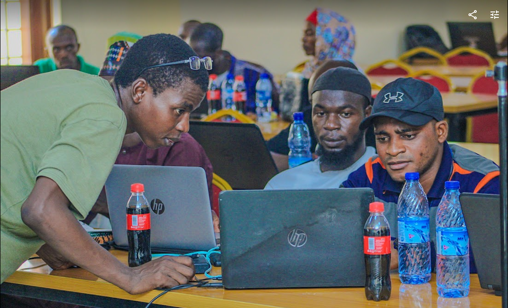

### 🚀 Welcome to Geek Ink – Where Learning Meets Innovation!  

> ***Learn by Doing, Build with Purpose—Beyond Code, We Solve. Empowering Lives Through Technology***.

At **Geek Ink**, we believe technology is more than just code—it's about **solving real-world problems** and making life easier for people. Our approach is simple:  

- [x] **Learn by Doing** – Gain hands-on experience through real projects.  
- [x] **Project-Based Learning** – Build solutions, not just write code.  
- [x] **Solve Problems with Code** – Technology should **empower** and **create impact**.  
- [x] **Make Life Easier** – Use innovation to drive meaningful change.  

## 🤝 Our Partnership with GDG on Campus  

Geek Ink is proud to **partner with GDG on Campus** to create an inclusive and impactful learning environment. Through this collaboration, we provide:  

- 🔹 **Expert-Led Web & Blockchain Mentorship**  
- 🔹 **Workshops on MLOps & DevOps**  
- 🔹 **Real-World Open Source & Industry-Ready Projects**  
- 🔹 **Community Support & Networking Opportunities**  

Together, we empower the next generation of developers to **build, innovate, and lead in the tech industry**.  

We provide **structured learning pathways** that guide you from **foundational concepts** to **advanced expertise** in Web Development, Blockchain, MLOps, and DevOps. Whether you're just starting or already have experience, **Geek Ink has a place for you!**  

**Choose your path and start building today!** 🚀  

### Jump right in TODO

### What to expect

### Frequently asked questions 

### Community
